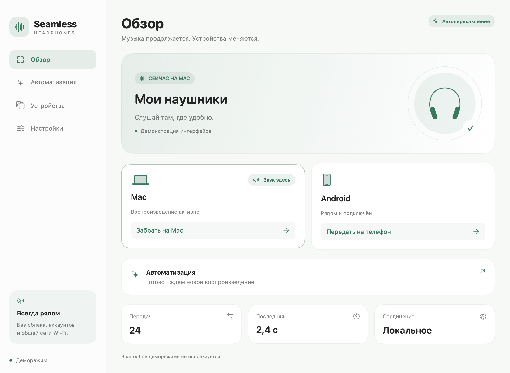
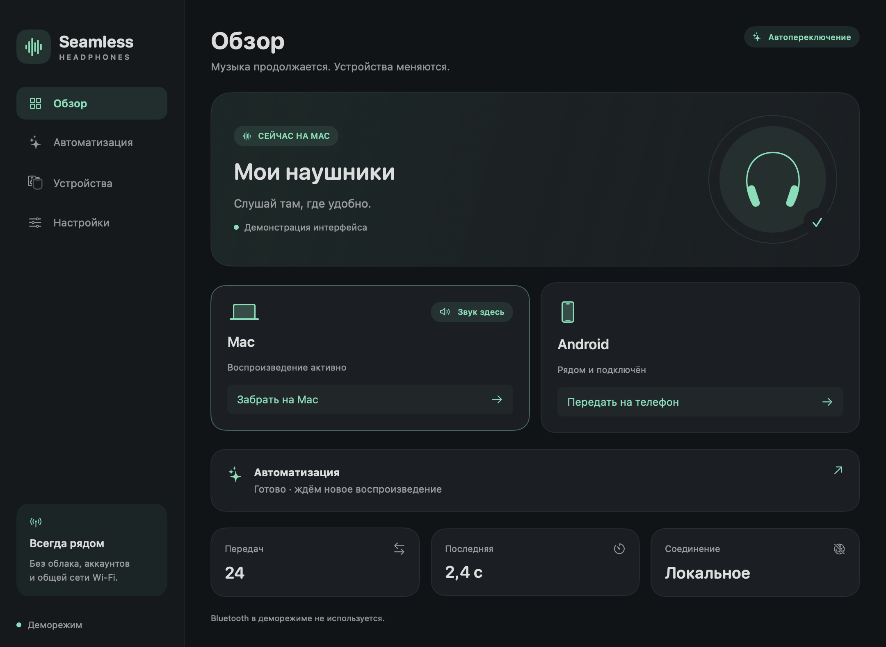

# Seamless Headphones

Твой звук между **Mac и Android**. Нативные Swift / SwiftUI и Kotlin, управление по BLE, без аккаунта, сервера и общей сети Wi-Fi. Независимая реализация с нуля; код PodSwitch не используется. Windows не поддерживается.

**Версия 0.2 — экспериментальная сборка с автоматическим переключением.** Логика автоматики реализована, но совместимость физического подключения зависит от Android и наушников. Это не универсальная замена экосистеме AirPods: обычный Android может запретить программное подключение A2DP. Сборки и список проверок — в [Releases](https://github.com/sifushka322/Seamless-Headphones/releases) и [validation](docs/validation.md).



## Что умеет

- Передавать наушники при **новом начале воспроизведения** в выбранном плеере: подготовка → освобождение → активное подключение → проверка маршрута.
- Два правила: следовать новому воспроизведению или переключать только когда предыдущий источник на паузе.
- Фильтр приложений, задержка 2–5 секунд, пауза между передачами, две минуты приоритета ручной команды.
- Блокировать передачу при удержании, доступных сигналах разговора/микрофона, отсутствии разрешений и устаревшем состоянии второго устройства.
- Останавливать автоматику после ошибки до явного возобновления. Не переигрывать старые события после восстановления связи.
- Восстанавливать BLE после временного обрыва; Mac возобновляет связь после сна, Android повторяет поиск с ограничением попыток.
- Четыре раздела на обеих платформах: обзор, автоматизация, устройства, настройки. Светлая, тёмная и системная темы; мята, кобальт и ирис; история, диагностика, состояния и причины блокировки.
- Хранить секрет в Keychain / Android Keystore, аутентифицировать команды HMAC-SHA256, отклонять повторы и чужую сессию.

## Первый запуск

1. **Mac:** macOS 14+, текущий DMG для Apple Silicon. Перенеси `Seamless Headphones.app` в Applications. Подпись ad hoc, нотарификации Apple нет; при блокировке запуска используй системное «Открыть всё равно», не отключай Gatekeeper целиком.
2. **Android:** Android 12+ (API 31). Установи APK. Он подписан тестовым сертификатом и предназначен для личной проверки.
3. Сопряги наушники с обеими ОС в системных настройках. Выбери одну и ту же пару в разделе «Устройства» приложений.
4. На Mac включи связь, перенеси ключ на телефон, сохрани его и нажми «Найти Mac». Разреши Bluetooth / устройства поблизости и уведомления.
5. На телефоне открой «Авто»: включи системный доступ к уведомлениям для Seamless (он нужен для API медиасессий), разреши состояние вызовов. Приложение не читает тексты уведомлений, номера, контакты или журнал звонков.
6. Проверь ручную передачу в обе стороны и слышимость своей музыки. Если Android блокирует A2DP, открой системные настройки: текущая сборка не обходит ограничения прошивки.
7. Для автоматической передачи включи автоматику на обоих устройствах. Дождись готовности, останови и **заново запусти** музыку на получателе. Уже играющая музыка при подключении не считается новой командой.

Закрытие окна Mac оставляет приложение в строке меню. На телефоне связь работает в foreground service с уведомлением и кнопкой остановки. После перезапуска приложения связь включается вручную. На Android после восьми неуспешных попыток восстановления нужен новый запуск поиска.

При обновлении с 0.1 внутренние bundle/package ID и хранилища оставлены прежними для сохранения настроек и доверия. Отображаемое название везде — Seamless Headphones. Обновлять нужно обе стороны.

## Где проходят границы

**BLE передаёт команды, а звук идёт через системный Bluetooth.** Интернет и Wi-Fi для связи не нужны, но Mac и телефон должны быть рядом и активны. Сон Mac исключает координацию передачи; после пробуждения связь восстанавливается.

Mac наблюдает активность CoreAudio-процессов, Android — состояние медиасессий. Это не анализ звука и не доказательство того, что пользователь слышит музыку. Постоянно открытый аудиопоток некоторых плееров может скрыть новый Play; реклама внутри разрешённого плеера неотличима от его музыки. Браузеры на Mac по умолчанию исключены.

Android проверяет A2DP и маршрут собственного бесшумного AudioTrack. Это не гарантирует маршрут всех сторонних плееров. Mac проверяет выбранный CoreAudio-выход по адресу в UID; неизвестное соответствие считается отказом. Приложение не переносит трек, позицию и очередь и не нажимает Play/Pause в сторонних приложениях.

Сигналы вызова/микрофона зависят от ОС. Перед важным разговором используй удержание. Передача звонков не реализована. Уже начатый системный вызов подключения может завершиться после отмены; автоматического отката с риском перехвата звука нет.

HMAC защищает подлинность команд, **не шифрует метаданные BLE**. Это экспериментальный локальный протокол, без внешнего аудита безопасности. В Android нет разрешения INTERNET, аналитики, записи аудио или accessibility service.

## Сборка и проверки

Mac: Command Line Tools, установленный современный macOS SDK, прямая компиляция Swift без внешних зависимостей:

```sh
bash scripts/test-macos.sh
bash scripts/build-macos.sh --dmg
```

`MACOS_SDK` переопределяет путь SDK. Целевая macOS 14.0, архитектура машины сборки. Наличие API наблюдения процессов дополнительно проверяется во время работы; недоступный монитор блокирует автоматику.

Android: JDK 17, SDK 35 / Build Tools 35.0.0, Gradle 8.11.1, AGP 8.9.1, Kotlin 2.1.20:

```sh
cd android
./gradlew testDebugUnitTest assembleDebug lintDebug
# На запущенном эмуляторе или подключённом тестовом устройстве:
./gradlew connectedDebugAndroidTest
```

`bash scripts/build-android.sh` использует локальные инструменты `.tools` или `JAVA_HOME`, `ANDROID_HOME`, `GRADLE_BIN` и копирует APK в `dist`. SDK/JDK, ключи, кеши и сборки не входят в Git. Для распространения потребуются постоянная release-подпись Android, Developer ID и нотарификация Mac.

## Код и документация

| Путь | Назначение |
|---|---|
| `macos/Sources` | SwiftUI, политика автоматики, CoreAudio, BLE peripheral, координатор |
| `android/app/src/main` | Kotlin UI, медиасессии, BLE central, foreground service, A2DP |
| `protocol/vectors.json` | Общие векторы протокола с синтетическим ключом |
| [Сценарии](docs/scenarios.md) | Продуктовые правила, Apple, аппаратная приёмка |
| [Протокол](docs/protocol.md) | Доверие, сообщения, транзакции и защита от устаревших событий |
| [Проверки](docs/validation.md) | Выполненные тесты и непроверенные аппаратные условия |


